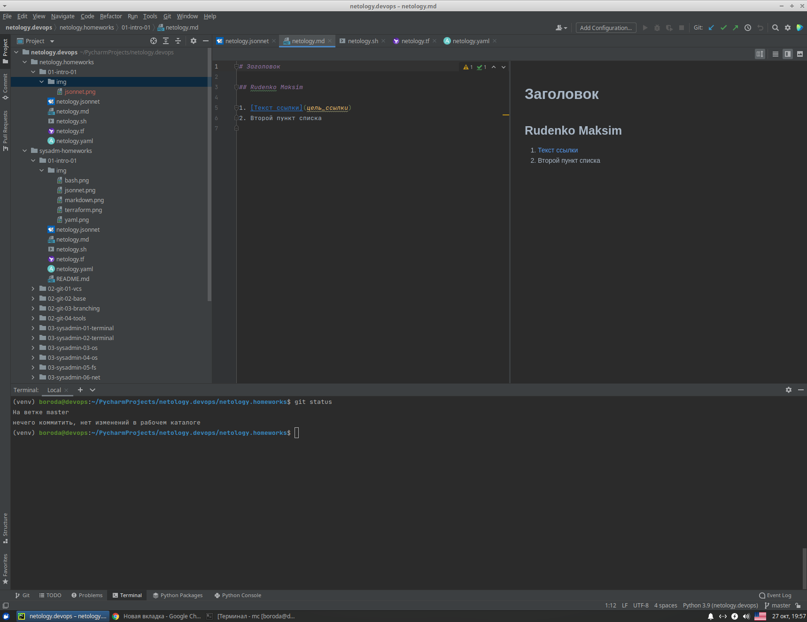

# Домашнее задание к занятию «1.1. Введение в DevOps»

## Задание №1 - Подготовка рабочей среды

Доказательства работы подсветки:

  - Terraform: 
  - Bash: 
  - Markdown: 
  - Yaml: 
  - Jsonnet: 

---
    
## Задание №2 - Описание жизненного цикла задачи (разработки нового функционала)

1. Клиент ставит Менеджеру новую задачу.
2. Менеждер обсуждает задачу с командой разработки и DevOps.
3. В результате совместного анализа:
  - Разработчики определяют стек технологий на котором будет решаться задача.
  - DevOps выявляет необходимость в масштабировании инфраструктуры.
  - Менеджер и тимлид формализуют задачу: задача разбивается на подзадачи, назначаются ответственные и планируются сроки выполнения.
4. Менеджер согласовывает формализованную задачу с клиентом.
5. Если необходимо, DevOps масштабирует инфраструктуру, конфигурирует системы мониторинга и агрегации логов и т.д.
6. Команда разработки пишет фичи и unit-тесты
7. Когда фича готова, тимлид запускает таск и:
  - Новая версия продукта проходит ВСЕ автотесты
  - Деплоится в тестовое окружение(разворачиваются контейнеры, производится билд, прописываются DNS и т.д.)
  - При возникновении ошибок -> шаг 5
  - Команде тестировщиков ставится задача приступить к тестированию
8. Команда тестировщиков проводит тестирование(функциональное, нагрузочное, интеграционное и т.д.):
  - В случае выявления дефектов -> шаг 5
  - В случае успеха - уведомляем Менеджера
9. Менеджер апрувит новую версию и она автоматически уходит на стейдж
10. Менеджер демонстрирует новую версию клиенту.
11. После согласования с клиентом новая версия продукта деплоится в продакшн.
