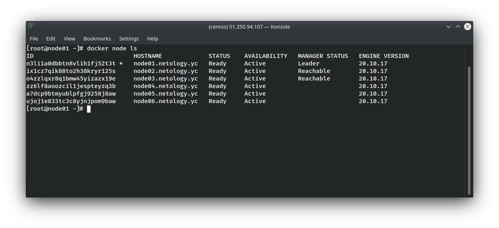
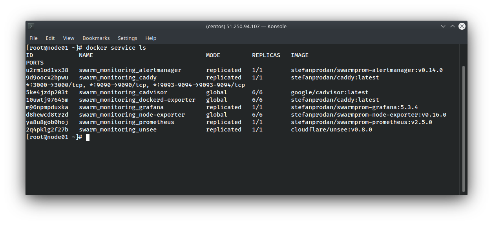

# Домашнее задание к занятию "5.5. Оркестрация кластером Docker контейнеров на примере Docker Swarm"

## Задача 1

Дайте письменые ответы на следующие вопросы:

- В чём отличие режимов работы сервисов в Docker Swarm кластере: replication и global?
  > Экземпляры/контейнеры сервисов, работающих в режиме `global`, запускаются на всех узлах кластера. Для сервисов работающих в режиме `replication`, Docker Swarm поддерживает кол-во реплик заданных в конфигурационном файле.
- Какой алгоритм выбора лидера используется в Docker Swarm кластере?
  > Для выбора лидера в Docker Swarm испольуется алгоритм поддержания распределенного консенсуса - `Raft`.
- Что такое Overlay Network?
  > `Overlay Network` - распределенная сеть кластера, посредством которой контейнеры с разных узлов взаимодействуют между собой (поддерживается шифрование трафика). Благодаря ей возможно получить доступ к микросервису через любой из узлов кластера (при этом контейнер может быть физически запущен на другом узле, Docker Engine сам найдет его и осуществит маршрутизацию).

## Задача 2

Создать ваш первый Docker Swarm кластер в Яндекс.Облаке

Для получения зачета, вам необходимо предоставить скриншот из терминала (консоли), с выводом команды:
```
docker node ls
```

<p align="center">
  
</p>

## Задача 3

Создать ваш первый, готовый к боевой эксплуатации кластер мониторинга, состоящий из стека микросервисов.

Для получения зачета, вам необходимо предоставить скриншот из терминала (консоли), с выводом команды:
```
docker service ls
```
<p align="center">
  
</p>

## Задача 4 (*)

Выполнить на лидере Docker Swarm кластера команду (указанную ниже) и дать письменное описание её функционала, что она делает и зачем она нужна:
```
# см.документацию: https://docs.docker.com/engine/swarm/swarm_manager_locking/
docker swarm update --autolock=true
```

